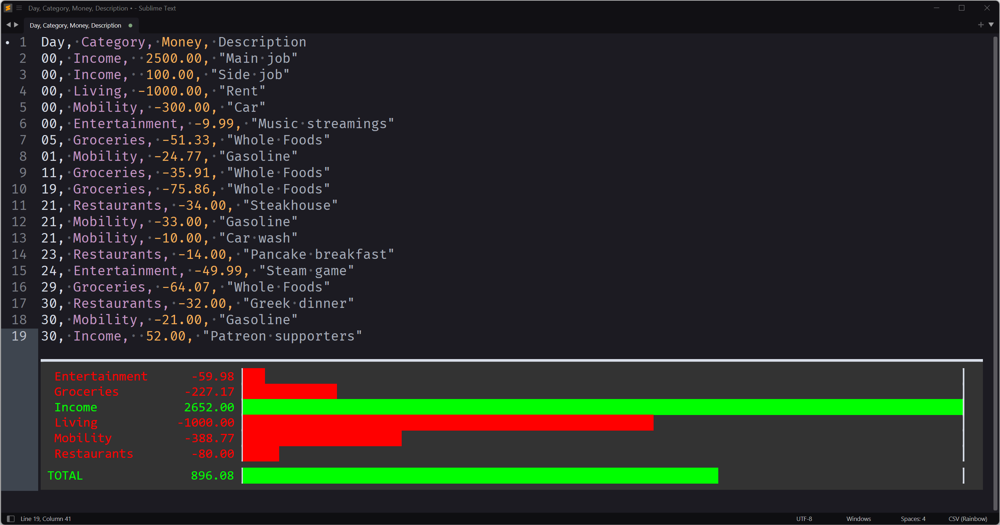

# LimeBud: Plaintext Budgeting in Sublime Text

*LimeBud* is a Sublime Text 3 plugin to show reports of plaintext budget files.
These files are based on the comma-separated values (CSV) format.
They are a human readable log of all expenses filed under multiple categories.
Based on these files, *LimeBud* creates a report of your expenses.
They help you in understanding how much you spent in each category and how much money you have left each month.

## Example

The following shows an example of a plaintext budget file for one month.
Each line is one expense and contains a day, a category, an expense, and a comment field:
Expenses that do not belong to a specific day can be set to day `00`.
Day and category should not contain any whitespace.
The name of the category and the text in the comment field can be freely chosen.
The expense should use a dot to separate cents (format: `[-][0-9]+.[0-9][0-9]`).
There is no currency support. Just use your main currency and stick to it.

    Day, Category, Money, Description
    00, Income,  2500.00, "Main job"
    00, Income,  100.00, "Side job"
    00, Living, -1000.00, "Rent"
    00, Mobility, -300.00, "Car"
    00, Entertainment, -9.99, "Music streamings"
    05, Groceries, -51.33, "Whole Foods"
    01, Mobility, -24.77, "Gasoline"
    11, Groceries, -35.91, "Whole Foods"
    19, Groceries, -75.86, "Whole Foods"
    21, Restaurants, -34.00, "Steakhouse"
    21, Mobility, -33.00, "Gasoline"
    21, Mobility, -10.00, "Car wash"
    23, Restaurants, -14.00, "Pancake breakfast"
    24, Entertainment, -49.99, "Steam game"
    29, Groceries, -64.07, "Whole Foods"
    30, Restaurants, -32.00, "Greek dinner"
    30, Mobility, -21.00, "Gasoline"
    30, Income,  52.00, "Patreon supporters"

To try out *LimeBud*, copy the example into a new file inside *Sublime Text*.
Open the *Command Palette* (`CTRL+SHIFT+P`) and type *LimeBud*.
Click the command or press `Enter` to generated a visual summary of the budget file.
In the end of the file (might require scrolling down), you will see an output similar to:

Noteworthy, you do not have to organize your plaintext budget files as months.
You can also keep different files for different purposes, e.g., personal, business, hobbies, or shared budgets.
The day category also supports full dates as long as they do not include any whitespace (e.g., 2018-04-21).
Just experiment around to find the best usage of it for your life.

**Note:** CSV files become much more readable and beautiful, if you use the [rainbow_csv package](https://github.com/mechatroner/sublime_rainbow_csv).

## Installation

First go to the plugin folder by clicking `Preferences > Browse Packages`.
On Windows the path should be similar to:

    C:\Users\<username>\AppData\Roaming\Sublime Text\Packages\

If you are using git, just clone this repository:

    git clone https://github.com/MartinWeigel/LimeBud.git

It will automatically create a subfolder *LimeBud* and add the plugin files.
Otherwise download the repository as ZIP archive and unzip the files to a subfolder called *LimeBud*.

## Preferences

You can adjust *LimeBud* by setting the following keys in your user preferences:

<dl>
<dt>limebud.invert</dt>
<dd>Inverts the expense column; i.e., income should be negative and expenses positive. Useful to avoid typing a lot of signs. Default: False.</dd>

<dt>limebud.percentages_only</dt>
<dd>If set, the report does not show the barchart, but the percentages instead. Default: False.</dd>
</dl>

## Other Applications

*[Bud](https://github.com/MartinWeigel/Bud.git)* is a commandline application for the plaintext budget files *LimeBud* is using.
Combined with other commandline tools, it creates an overview of multiple files.
